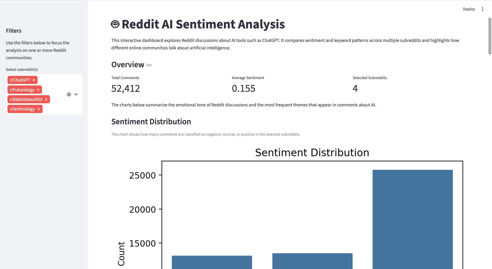
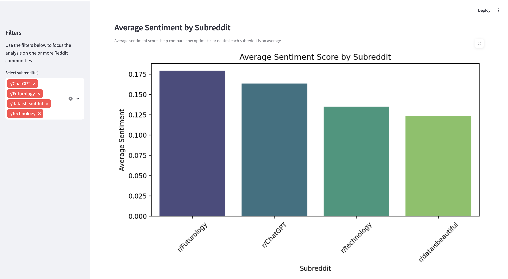

# Reddit AI Sentiment Analysis

*An interactive Streamlit dashboard exploring sentiment and keyword patterns in Reddit discussions about AI tools.*

This project was developed during a data analytics hackathon. The goal is to explore how Reddit users discuss artificial intelligence tools such as ChatGPT by analyzing sentiment and keywords in Reddit comments.

The project combines **data cleaning, exploratory data analysis (EDA), sentiment analysis, and an interactive dashboard** to highlight patterns in online discussions about AI.

## Dashboard Preview

<p align="center">

</p>

<p align="center">

</p>

---

# Project Objectives

The analysis focuses on three main questions:

- What is the overall sentiment of Reddit discussions about AI?
- Do different subreddits show different attitudes toward AI tools?
- What are the most common themes and keywords in these discussions?

---

# Tech Stack

- Python
- Pandas
- NLTK (VADER Sentiment Analyzer)
- Matplotlib
- Seaborn
- WordCloud
- Streamlit

---

# Project Structure

```
Hackathon-II-genai/
│
├── app/
│   └── streamlit_app.py        # Interactive dashboard
│
├── data/
│   ├── raw/                    # Original dataset
│   └── processed/
│       └── chatgpt_final_dataset.csv
│
├── notebooks/
│   └── 01_eda_sentiment.ipynb  # Data cleaning and analysis
│
└── README.md
```

---

# Data Processing Pipeline

The analysis follows these steps:

1. **Load Reddit dataset** containing comments from several AI-related subreddits.

2. **Text preprocessing**
   - Lowercasing
   - Removing punctuation
   - Removing stopwords

3. **Keyword preparation**
   - Extract meaningful keywords from comments
   - Remove additional common words specific to Reddit discussions

4. **Sentiment analysis**
   - VADER sentiment analyzer is used to compute a sentiment score
   - Each comment is classified as:
     - Positive
     - Neutral
     - Negative

5. **Feature engineering**
   The final dataset contains the following columns:

   - `comment_body`
   - `subreddit`
   - `text_clean`
   - `text_no_stopwords`
   - `text_keywords`
   - `sentiment_score`
   - `sentiment`

6. **Export processed dataset**

The final dataset is saved to:

```
data/processed/chatgpt_final_dataset.csv
```

---

# Interactive Dashboard

The project includes a **Streamlit dashboard** that allows interactive exploration of the results.

The dashboard includes:

- Sentiment distribution
- Average sentiment by subreddit
- Keyword frequency analysis
- Word cloud visualization
- Example positive comments from the dataset

---

# Running the Dashboard

Install dependencies:

```
pip install pandas matplotlib seaborn nltk wordcloud streamlit
```

Then run:

```
streamlit run app/streamlit_app.py
```

The dashboard will open in your browser.

---

# Key Insights

- Reddit discussions about AI are generally **positive or neutral**.
- Different communities discuss AI in **different contexts and tones**.
- Frequent keywords highlight practical uses of AI such as writing, productivity, and search.

---

# Future Improvements

This project was developed within the time constraints of a hackathon. Due to API access limitations during the event, the analysis relies on a static dataset rather than collecting data directly from Reddit. Several improvements could expand the scope and analytical power of the project:

- **Direct Reddit Data Collection**  
  Integrate the Reddit API (via PRAW or the official Reddit developer platform) to collect comments dynamically instead of relying on a static dataset.

- **Comparison Between AI Models**  
  Extend the analysis to compare discussions about different AI systems (for example **ChatGPT vs Claude**) across multiple subreddits.

- **Time-Based Analysis**  
  Add timestamps to the dataset and analyze how sentiment changes over time as new AI models are released.

- **Topic Modeling**  
  Apply techniques such as LDA or BERTopic to automatically detect major themes in AI discussions.

- **More Advanced Dashboards**  
  Expand the Streamlit app with:
  - sentiment filters
  - comment search
  - subreddit comparison views

- **Deployment**  
  Deploy the dashboard online (for example using Streamlit Cloud) so that users can explore the analysis interactively.

---

# Hackathon Context

This project was created as part of a **data analytics hackathon focused on exploratory data analysis, visualization, and interactive dashboards**.

The emphasis of the project is on building a **complete data pipeline from raw text data to an interactive analytical product**.